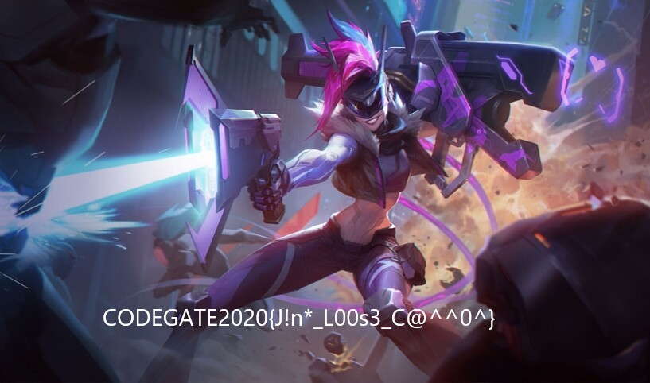

# CODEGATE2020 write-up

ENIGMA
----------

題目給一隻zip file：4728ce19e1498b50384b3b392ab22ebe  
解開拿到enigma：  

```txt
DON'T LET YOUR RIGHT HAND KNOW WHAT YOUR LEFT HAND DID
5+,'( "2( )+-3 r-/:( :*,5 ',+1 1:*( )+3 "26( :*,5 5-d


ONCE A HACKER IS AN ETERNAL HACKER
+,92 * :*9'23 -4 *, 2(23,*" :*9'23


A HACKER WITHOUT PHILOSOPHY IS JUST AN EVIL COMPUTER GENIUS
* :*9'23 1-(:+-( @:-"+4+@:) -4 ;_4( *, 2?-" 9+.@_(23 /2,-_4

flag is :
9+52/*(22020{:*9'234 *32 ,+( !+3, +,") -( -4 .*52}
```

看起來是明文跟密文啦，最後是flag  
像替換式的加密，其實可以一個一個查找  
不過還是寫了程式來解：solve.py  

```python
#!/usr/bin/env python3

p1 = "DON'T LET YOUR RIGHT HAND KNOW WHAT YOUR LEFT HAND DID"
c1 = "5+,'( \"2( )+-3 r-/:( :*,5 ',+1 1:*( )+-3 \"26( :*,5 5-d"

p2 = "ONCE A HACKER IS AN ETERNAL HACKER"
c2 = "+,92 * :*9'23 -4 *, 2(23,*\" :*9'23"

p3 = "A HACKER WITHOUT PHILOSOPHY IS JUST AN EVIL COMPUTER GENIUS"
c3 = "* :*9'23 1-(:+-( @:-\"+4+@:) -4 ;_4( *, 2?-\" 9+.@_(23 /2,-_4"

#cflag = "9+52/*(22020{:*9'234 *32 ,+( !+3, +,\") -( -4 .*52}"
cflag = ":*9'234 *32 ,+( !+3, +,\") -( -4 .*52"

p = p1 + p2 + p3
c = c1 + c2 + c3

table = {}
conflict = {}
for i in range(len(c)):
    if c[i] not in table:
        table[c[i]] = p[i]
    elif c[i] in table and table[c[i]] != p[i]:
        conflict[c[i]] = table[c[i]] + ' ' + p[i]
print(conflict)

pflag = ''
for i in cflag:
    if i in table:
        pflag += table[i]
    else:
        pflag += i
print(pflag)

for i in range(26):
    if chr(0x41 + i) not in p:
        print(chr(0x41 + i))

```

執行結果：

```
{'-': 'U I', "'": "' K"}
HAC'ERS ARE NOT !ORN ONLY UT US MADE
B
Q
X
Z
```

後來發現c1好像少一個對應到p1的YOUR的-，所以c1我有改過  
cflag是因為懶得處理CODEGATE2020{...}的2020跟{}，乾脆只留裡面的密文去解  
有的密文會有兩個明文解，抓到conflict印出來看  
把英文單字修一下，UT US應該是IT IS  
最後發現!沒有解，所以去看哪個英文字母沒有在明文出現過  
flag：CODEGATE2020{HACKERS ARE NOT BORN ONLY IT IS MADE}  

------------------------

LOL
---------

題目給zip file：a25d7f636b538ec7d456bda96828164f  
解開得Legend.gif  
嗯...binwalk  

```
DECIMAL       HEXADECIMAL     DESCRIPTION
--------------------------------------------------------------------------------
0             0x0             JPEG image data, JFIF standard 1.01
382           0x17E           Copyright string: "Copyright (c) 1998 Hewlett-Packard Company"
91345         0x164D1         JPEG image data, JFIF standard 1.01
91727         0x1664F         Copyright string: "Copyright (c) 1998 Hewlett-Packard Company"
183730        0x2CDB2         JPEG image data, JFIF standard 1.01
184112        0x2CF30         Copyright string: "Copyright (c) 1998 Hewlett-Packard Company"
293597        0x47ADD         JPEG image data, JFIF standard 1.01
293979        0x47C5B         Copyright string: "Copyright (c) 1998 Hewlett-Packard Company"
404067        0x62A63         JPEG image data, JFIF standard 1.01
404449        0x62BE1         Copyright string: "Copyright (c) 1998 Hewlett-Packard Company"
508909        0x7C3ED         JPEG image data, JFIF standard 1.01
509291        0x7C56B         Copyright string: "Copyright (c) 1998 Hewlett-Packard Company"
605001        0x93B49         JPEG image data, JFIF standard 1.01
605383        0x93CC7         Copyright string: "Copyright (c) 1998 Hewlett-Packard Company"
688620        0xA81EC         JPEG image data, JFIF standard 1.01
772953        0xBCB59         JPEG image data, JFIF standard 1.01
773335        0xBCCD7         Copyright string: "Copyright (c) 1998 Hewlett-Packard Company"
```

那個沒有copyright那張怪怪的對吧(✧≖‿ゝ≖)  
用foremost或dd把他拖出來看一下RRRRRR  

